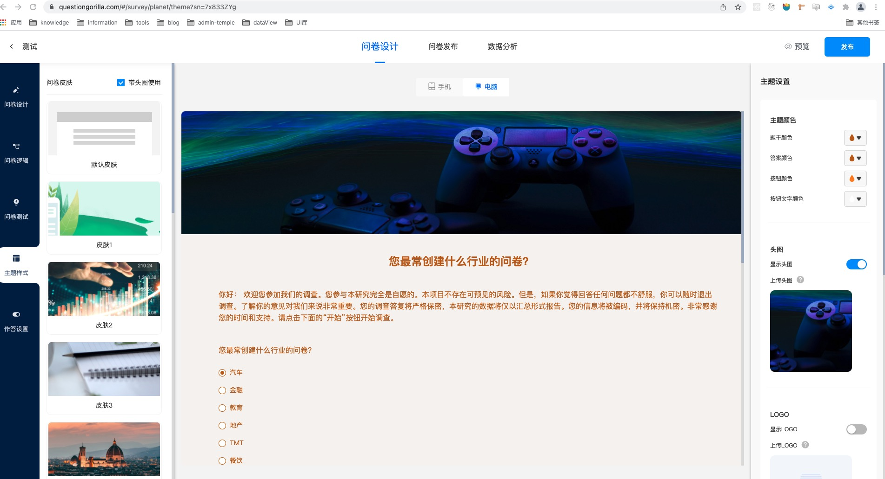

# 项目复盘
## 调研猩球
项目名称： 调研猩球

负责模块： 主题设计

实际工期： 4天（功能开发，bug 修复，性能优化）

功       能：  题型皮肤配置，有两种模式（pc , mobile ）不同皮肤对应不同的配置项，可以对皮肤的头图，背景，透明度等进行配置

技术栈： 

		1: vuex存储皮肤配置的初始化状态的数据

		2: hooks 封装主要用于对初始化数据进行处理，皮肤的配置所见即所得

		3: 运用了色板插件 colorpicker-v3 ，对该组件进行二次封装优化 https://blog.csdn.net/qq_45768871/article/details/122739732

		4: 运用vue-cropper实现 图片剪辑功能 https://github.com/xyxiao001/vue-cropper

开发中遇到的问题：

		1: 数据不更新主要体现在-对皮肤进行颜色，头图，动态改变logo 配置时，(pc,mobile)组件中并未及时更新
		2: 色板插件开发环境正常显示，线上环境样式库并未引进来

解决办法：

		1: 配置项数据发生变化时，在该组件对数据进行监听 ：举个🌰 ，配置项对logo 位置进行修改，由于模型组件已经创建完，更改配置并不会二次更新模型组件，所以采用在该组件对数据进行监听，重新对样式进行赋值
		2: 追溯 色板插件所引用的样式库，将其复制到该色板组件同级进行引用，成功解决线上环境色板样式库找不到的问题

